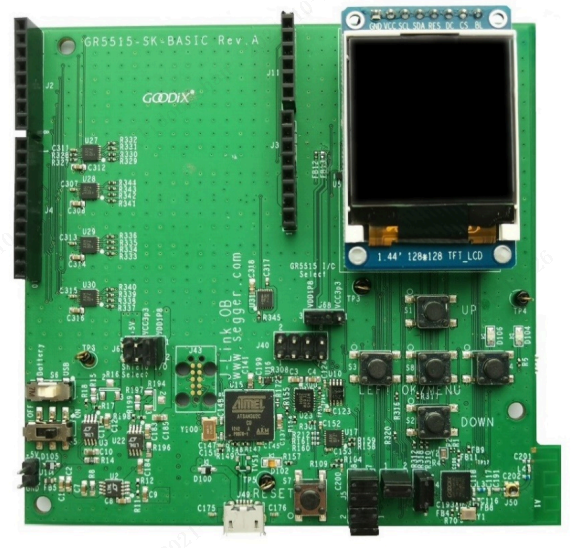

# 快速上手GR5515 SK开发板

## 开发板介绍

### 开发板概述
GR5515 Starter Kit（以下简称GR5515 SK）套件是基于的GR551x芯片（支持Bluetooth 5.1）设计的开发平台，包含Starter Kit开发板（以下简称GR5515 SK板）、原理图和使用指南。用户可以在该平台上熟悉GR551x开发工具以及快速搭建自己的产品原型并验证相关功能。

开发板如下图所示：



### 开发板功能

*  支持Bluetooth 5.1的单模低功耗蓝牙SoC
*  多功能按键和LED指示灯
*  支持Arduino模块插接接口，IO电压可以通过level shift灵活配置
*  支持调试功能的SEGGER J-Link OB
*  UART转USB接口
*  Micro USB接口连接PC
*  1.44寸TFT彩色显示屏
*  板上集成QSPI Flash

为了更好的使用GR5515 Starter Kit套件，建议参考下表相关资料。

|            名称            |                                                                                       描述                                                                                        |
| ------------------------- | --------------------------------------------------------------------------------------------------------------------------------------------------------------------------------- |
| GR5515 Starter Kit用户指南 | 介绍GR5515 Starter Kit套件使用方法： [《GR5515 Starter Kit用户指南》]( https://docs.goodix.com/zh/online/detail/gr5515_starter_kit_user_guide/V1.7/42a03ba92cad1d63afd9baa8bb8c37df) |
| GR551x开发者指南           | GR551x软硬件介绍、快速使用及资源总览： [《GR551x开发者指南》]( https://docs.goodix.com/zh/online/detail/gr551x_develop_guide/V2.3/27f7d503bcd7ad1d63fa5b316b3bde4f)                    |
| J-Link用户指南             | J-Link使用说明：www.segger.com/downloads/jlink/UM08001_JLink.pdf                                                                                                                   |
| GR5515-SK-BASIC-RevC      | GR5515 Starter Kit开发板原理图：[《GR5515-SK-BASIC-RevC.pdf》]( https://product.goodix.com/zh/docview/GR5515-SK-BASIC-RevC_Rev.1.5?objectId=100&objectType=document&version=133)   |


## 代码下载

### 安装repo

1. 创建repo安装目录：命令行输入`mkdir ~/bin`
2. 下载repo：命令行输入`wget https://storage.googleapis.com/git-repo-downloads/repo -P ~/bin/`
3. 改变执行权限：命令行输入`chmod a+x ~/bin/repo`
4. 设置环境变量：在~/.bashrc文件的最后输入`export PATH=~/bin:$PATH和export REPO_URL=https://mirrors.tuna.tsinghua.edu.cn/git/git-repo/`
5. 重启shell

### 下载系统

笔者使用的系统版本标签是3.0.1_LTS，仅在此版本进行了验证，建议读者下载此版本的源码。

源码下载步骤：

1. 打包下载所有文件，此时默认的Harmony版本为3.0.1_LTS：`repo init -u https://gitee.com/openharmony/manifest.git -b refs/tags/OpenHarmony-v3.0.1-LTS --no-repo-verify`。
2. 下载好仓库后，输入：`repo sync -c`，也就是下载当前分支的代码。
3. 下载好代码后，输入：`repo forall -c 'git lfs pull'`，下载部分大容量二进制文件。


### 下载GR5515源码

如果下载系统时选择了打包下载，可跳过此步。

1. 从https://gitee.com/openharmony/device_soc_goodix.git 下载device仓内容。
2. 从https://gitee.com/openharmony/vendor_goodix.git 下载vendor仓内容。


## 确认目录结构

在device文件夹下，确保device文件夹目录结构如下

```shell
user:~/Harmony/device$ tree -L 3
.
└── goodix
    └── gr551x
        ├── adapter             # 外设驱动、BLE、文件系统适配
        ├── BUILD.gn            # GN构建脚本
        ├── components          # 组件
        ├── drivers             # HDF外设驱动
        ├── hcs                 # 设备描述文件
        ├── sdk_liteos          # Liteos GR551x SDK适配
        └── tools               # 固件生成工具
```
在vendor文件夹下，确保vendor文件夹目录结构如下

```shell
user:~/Harmony/vendor$ tree -L 3
.
└── goodix
    ├── gr5515_sk_iotlink_demo   # BLE IOT应用示例工程
    │   ├── BUILD.gn             # GN构建脚本
    │   ├── config.json          # 子系统裁配置裁剪脚本
    │   ├── hals                 # 产品参数配置
    │   ├── patches              # 源码补丁
    │   └── patch.yml            # 补丁执行脚本
    └── gr5515_sk_xts_demo       # XTS测试示例工程
        ├── BUILD.gn             # GN构建脚本
        ├── config.json          # 子系统裁配置裁剪脚本
        ├── tests                # 测试用例
        ├── hals                 # 产品参数配置
        ├── patches              # 源码补丁
        └── patch.yml            # 补丁执行脚本
```

## 设置编译工具链

1. 编译链工具推荐使用gcc-arm-none-eabi-10-2020-q4-major。(下载网站：https://developer.arm.com/tools-and-software/open-source-software/developer-tools/gnu-toolchain/gnu-rm/downloads )。
2. 执行`vim ~/.bashrc`。
3. 将工具链的路径加入环境变量, 如:`export PATH=/home/tools/ARM/gcc-arm-none-eabi-10-2020-q4-major/bin:$PATH`。
3. 保存后执行`source ~/.bashrc`使环境变量生效。

## 编译工程

进入源码根目录编译工程

   ​	`hb set -root .`   选择当前路径为工程根目录

   ​	`hb set -p `       选择工程

    goodix
        >gr5515_sk_iotlink_demo
         gr5515_sk_xts_demo

   ​	`hb build -f --patch`  打patch并开始编译，后续修改了文件只需要执行`hb build -f`即可，不需要重复以上步骤。

## 固件烧录

生成的固件位于out/gr551x/${Project_name}/bin/application_fw.bin，固件烧录工具GProgrammer下载地址：https://product.goodix.com/zh/software_tool/gprogrammer 。

1. 将固件拷贝至Windows目录下；
2. 到Goodix官网下载最新的固件烧录工具GProgrammer.exe和对应的指导文档手册，安装后按照文档指导进行固件烧录。

## 相关仓库

[vendor_goodix](https://gitee.com/openharmony/vendor_goodix)
